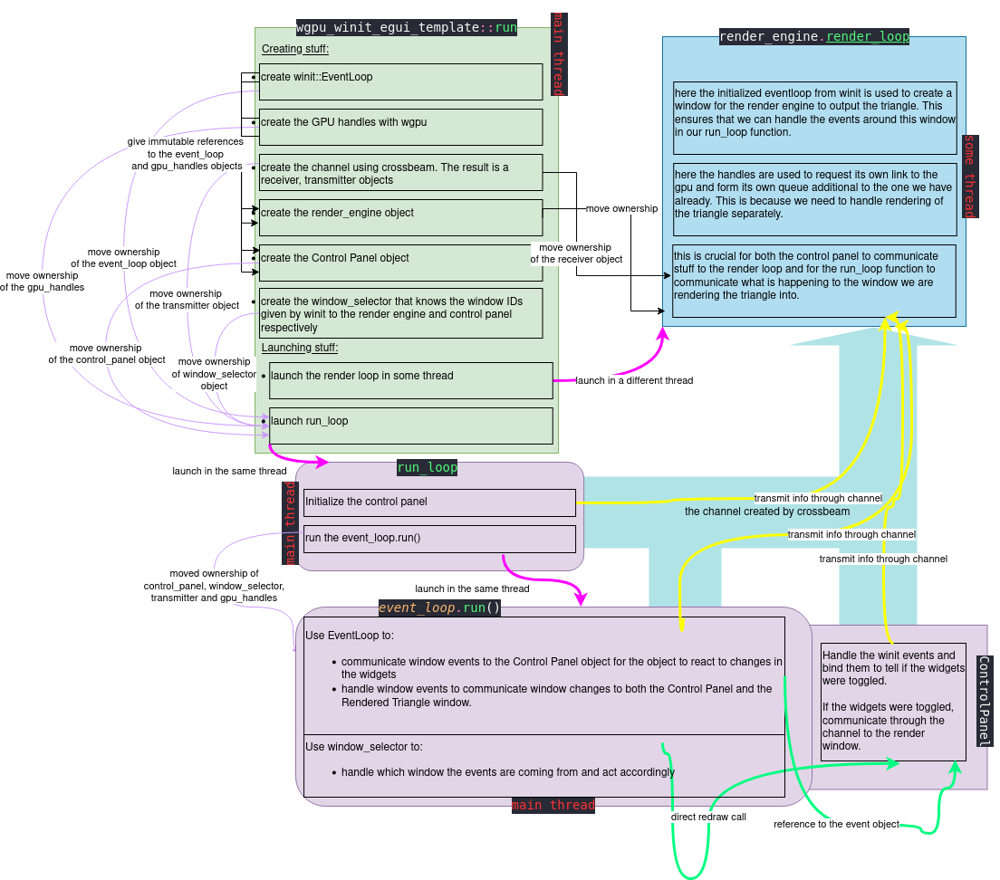

## Architectural analysis of the wgpu + egui + winit module

### Used crates/modules 

From the name it is quite obvious that we will use **wgpu**, **egui** and **winit**. However, we will also use **crossbeam**. 

**wgpu** is used to render both the gui (i.e. the Control Panel window) and the triangle render window. Furthermore, we also use wgpu to render the triangle inside the window itself. 

**egui** is used to create the control panel and its widgets. The library also handles listening to the events coming from the widgets. 

**winit** is used to create the windows themselves. The library also handles the events concerning to what happens to the window: resizing, dragging, clicking, scrolling, keyboard input, etc. Pretty much anything the window can be expected to react to.  

**crossbeam** is used to create a channel of communicaton between the Control Panel and the Render Engine

### The setup

We will look at it from a modules point of view. As such, we have 3 main ones:

* Main `run()`  function that subsequently calls and blocks on an asynch  `run_loop()` function.
* `render_engine`
* `control_panel` 

In the following we try and visualize what's going on. 
**Little drawing**

And with this in mind, we can go through the data flow in the code. 
Basically, after the initializations we need to communicate two things: (1) what events we recieve in the two windows from **winit** and (2) what events we recieve from the Control Panel (**egui**). The fun thing is that (2) relies on (1) as our gui lives inside the window. 

The main thread is where a lot of the architecture action is located. Here we initialize the objects, launch the additional thread for the Render Engine and run the EventLoop handling our windows. It would be tedious to go through all the movement of the objects in words, so the keen reader is directed towards the drawing instead. 

The thread running the Render Engine has mostly its own data. The interesting part to consider here is that we need to let it use the channel of communication between the main thread and its own thread. This is done by instantiating that said channel which returns a receiver, transmitter pair. The main thread moves ownership of the receiver to the thread running the render engine as well as the render engine object itself. This thread will now be able to receive communication from the main thread about what is happening to the window it is rendering the triangle into as well as the information passed by the user of the gui through its own window. 

## Extras

### JAX

JAX is an amazing library allowing modeling code to run fast (when used right), the paradigm being quite mathematical in terms of pure functions with inputs and outputs, as well as, the support for arbitrary convoluted autodiff operations that no other library supports. All at a cost of learning to program in a more functional manner and being on the lookout for the sharp bits. 

### Concepts from m1

There are a few concepts from m1 that are at play in the JAX ecosystem. Probably more than I can see right now, but I will try to talk about a few of them. Just as Pytorch, JAX uses **Computational Graphs**, whereas the difference between the two is that JAX's graphs are static. Thus, we need to have a full overview of our computation before executing it. Pytorch, on the other hand is using dynamic graph. 

Because JAX is built to use Just-in-time (JIT) compilation using the XLA compiler, we need to be more careful about many things. One of the things enforced by the compilation is that shapes needs to be known at compile time. This is sorta like when we learned that in Rust, we cannot use variable sized objects on the stack memory. 

JAX is built to be a numerical computation library with support for automatic differentiation and as such it is heavily targeted towards accelerators such as **GPU**s. The XLA (Accelerated Linear Algebra) is built to be running on all sorts of accelerators dependless on the manufacturer or type (TPU/GPU). In this light, what we learned doing our own little matrix multiplication a GPU is probably heading towards something done by professionals when translating the linear algebra operations definable in jax to be executed on the accelerators. 

### Concepts from m2

The topic of m2 was **Concurrency** and JAX relies heavily on it when utilizing the accelerator hardware that is specifically built to run many simple operations in parallel. In JAX, we usually __vmap__ some function over a batch/array of inputs. This allows the underlying library to distribute our computation to **threads** on the accelerator as it sees fit. This is one of the reasons to why the JAX objects immutable and the functions have to be pure i.e. no side effects or states. This is to avoid the data races and weird/unsafe behaviour. What we did with **Locks** and **Message passing** between threads still has to be done internally by JAX, but they probably use same kind of ideas when distributing pieces of our array to the different threads. 
Particularities of the different accelerators and how they are connected (if we use more GPUs at once fx.) plays a big role and for sure has internal JAX optimization for this. Whether or not the Nvidia cards are connected with NVlink has an effect as well whether the cards have distributed shared memory that we learned about in the section on **Additional Levels in the Memory Hierarchy**. 

No matter what, this piece of software is quite impressive to a newbie like me. When handling many accelerators at once, it must be a challenge to bring the logic to a common denominator. (that is constatly evolving). For instance, when we did the assignment on GPU programming, it was discovered that __wgsl__ with the Vulkan backend on our system does not throw an error when we were indexing out of bounds. On assignment it was totally quiet and on retrieval it just returned the last available value. This is probably why JAX has similar out of bound handling behaviour. 

### Performance implications

SPEEEED for linear algebra and math computations because of (a) compilation and (b) accelerator utilization. For this to be a benefit, one needs to be tired of waiting for one's mediocre model to be done training.
The next bottleneck to handle is probably memory and feeding the accelerators fast enough to bring their utilization to the max. 
* * *

